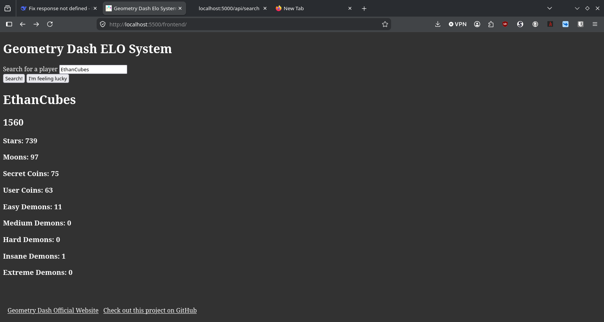

# Geometry Dash Elo System
A program that assigns a skill rating to Geometry Dash players by the levels they have completed.



(link)

## Features
- A backend that returns fetches user data straight from RobTop's Geometry Dash servers
- A algorithm that converts the user data returned from RobTop's servers into readable data.
- Another algorithm that uses the data from RobTop's servers to calculate a skill rating/ELO.
- A front end that looks nice (or tries to).

## How it works
The client (frontend) sends a request to the server (backend) containing the search query for a user. The backend then sends the name of the user to RobTop's servers, which returns statistics about the user. The username is then also sent to the AREDL API to get list points. The list points and the statistics are calculated into an Elo, which can be from like 1 to several billion probably.The stats and Elo are sent back to the client/frontend to be displayed on a webpage. 

## How to run locally
### Requirements
(Will probably work with other versions but still)
- Python 3.14.6
- Flask 3.1.3 (Python Module)
- Flask_cors 6.0.2 (Python Module)
- Requests 2.34.2 (Python Module)
- Git (Version control)

### Instructions
I'm assuming you are using VSCode in this tutorial.
- Clone the repository to your device, open with VSCode
- Open the terminal (Control + `)
- Run ```cd backend``` to go into the backend folder
- Run ```cd src``` to go into the source folder inside the backend folder.
- Run ```flask --app main run``` to start the server on localhost port 5000.

- Now go into the frontend folder (not inside the terminal)
- Go into the source folder open the script.js.
- Change the url on line 18 to ```http://localhost:5000/api/search``` (this is necessary to run it fully locally, otherwise the frontend will attempt to fetch data from the backend deployed on MY servers.)
- Go back into the frontend folder and open index.html. 


## Credits
- GD Colon's [video on making his own Geometry Dash website](https://www.youtube.com/watch?v=tC-TZX0AAck) was very entertaining and somewhat informative.
- [Boomings.dev](https://boomlings.dev) and [GDDocs](https://wyliemaster.github.io/gddocs/#/) were great resources in learning about how to send requests.
- [AREDL API Documentation](https://api.aredl.net/v2/docs) was helpful in accessing the AREDL API.
- I've highkey never done backend web devlopment before, so as much as I hate to admit it, I used AI (specifically DeepSeek, for deployment and hosting of the backend)
